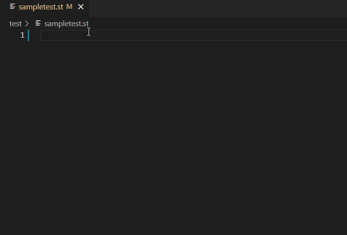
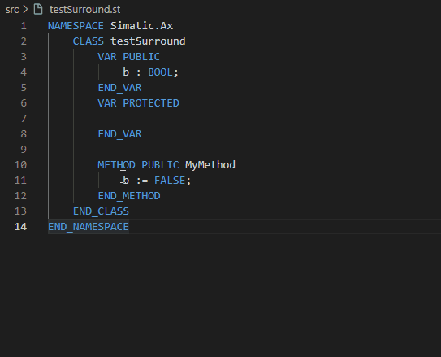
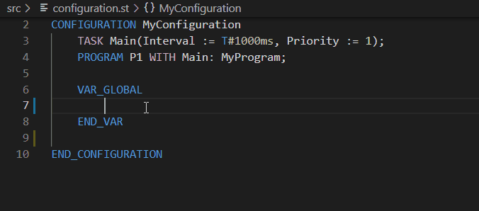
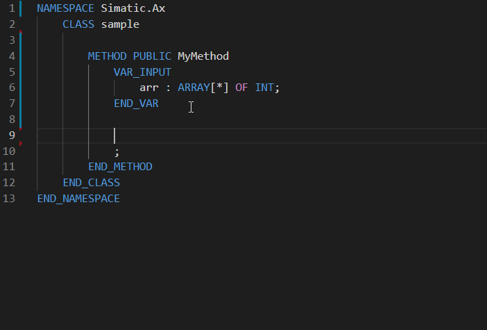

# Snippets collection

A collection of useful user defined snippets for AX Code.

## Install the snippets collection

To install the snippets collection to your workspace enter the following command in a terminal:

```bash
apax add @simatic-ax/snippetscollection --dev
```

> to install this package you need to login into the GitHub registry. You'll find more information [here](https://github.com/simatic-ax/.sharedstuff/blob/main/doc/personalaccesstoken.md)

## AXUnitSupport

### Create a test fixture with AxUnit.Assert

```json
"prefix": ["AxUnit test-fixture"]
```

Output example:



### Insert Using AxUnit.Assert

```json
"prefix": ["AxUnit, using ax"]
```

Output:

```iecst
USING AxUnit.Assert;
```

### AxUnit assertions

```json
"prefix": ["eq, ne, lt, gt"]
```

Output:

```iecst
Equal(expected := 0, actual := 0);
NotEqual(expected := 0, actual := 0);
LessThan(expected := 0, actual := 0);
GreaterThan(expected := 0, actual := 0);
```

## Surround with



Available surround with:

- FOR ... END_FOR;
- IF ... THEN ... ELSE
- WHILE ... END_WHILE
- REPEAT .. END_REPEAT
  
## Snippets Namespace Support

### NamespaceSupport

```json
"prefix" : ["namespace, Siemens"]
```

Output:

```iecst
NAMESPACE Simatic.Ax
    
END_NAMESPACE
```

### Snippets for class support

```json
"prefix" : ["class template, End_Class"]
```

Output:

```iecst
NAMESPACE Simatic.Ax
    CLASS Untitled
        VAR PUBLIC
            
        END_VAR
        VAR PROTECTED
            
        END_VAR
        
        METHOD PUBLIC MyMethod
            ;
        END_METHOD
    END_CLASS
END_NAMESPACE
```

### ClassMethodSupport

```json
"prefix" : ["method, no return"]
```

Output:

```iecst
METHOD PUBLIC|PRIVATE|PROTECTED MyMethod
    ;
END_METHOD

METHOD PUBLIC|PRIVATE|PROTECTED MyMethod : Type
     MyMethod := ;
END_METHOD

// types: BOOL,INT,LREAL,WORD,REAL,DINT,UINT,SINT
```

### VAR sections within classes

```json
"prefix" : ["varc"]
```

Output:

```iecst
VAR PUBLIC|PRIVATE|PROTECTED 
    ;
END_VAR
```

### VAR sections within methods and functions

```json
"prefix" : ["vari"]
```

Output:

```iecst
VAR_INPUT|VAR_OUTPUT|VAR_IN_OUT|VAR_TEMP|VAR CONSTANT
    count: INT;
END_VAR
```

## Enumeration

```json
"prefix" : ["enum"]
```

Output:

```iec-st
TYPE
    Colours : (RED, GREEN, BLUE) := RED;
END_TYPE
```

## IO support

```json
"prefix" : ["io"]
```

Support for creating IO Tags in the VAR_GLOBAL section. Suported types `BOOL`, `BYTE`, `WORD`, `DWORD`

Output example:



## Iterate ARRAY[*] Snippet

```json
"prefix" : ["Iterate Array*"]
```

Output example:



## Contribution

Thanks for your interest in contributing. Anybody is free to report bugs, unclear documentation, and other problems regarding this repository in the Issues section or, even better, is free to propose any changes to this repository using Merge Requests.

### Markdownlint-cli

This workspace will be checked by the [markdownlint-cli](https://github.com/igorshubovych/markdownlint-cli) (there is also documented ho to install the tool) tool in the CI workflow automatically.  
To avoid, that the CI workflow fails because of the markdown linter, you can check all markdown files locally by running the markdownlint with:

```sh
markdownlint **/*.md --fix
```

## License and Legal information

Please read the [Legal information](LICENSE.md)
